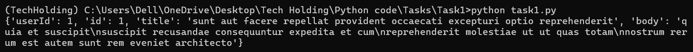

# 1 Create virtual environment Using conda
command: conda create -n TechHolding python=3.11
# 2 Conda Activate the virtual environment
command: conda Activate TechHolding // for deactivate use command Dactivate
# 3 Install requests package
command: conda install request
# 4 Create task1.py file
# 5 run command 
command: python task1.py
# 6 Output
  